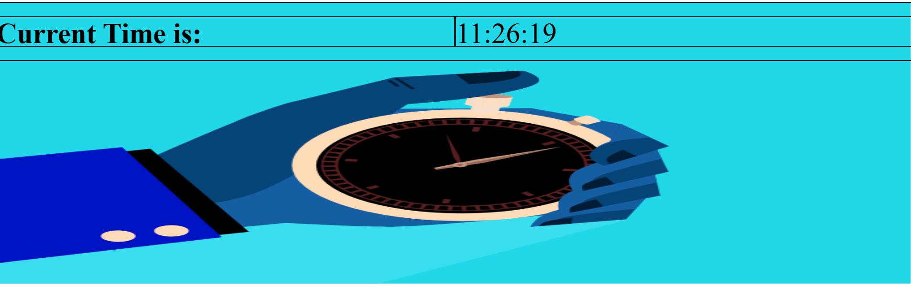

# 🕒 JavaScript Clock

A simple and visually appealing real-time digital clock built using **HTML**, **CSS**, and **JavaScript**.

## 🔗 Live Demo
👉 [View Clock](https://mahak-shar.github.io/JavaScript-Clock/)

## 📸 Preview


## 🛠️ Features
- Displays the **current time** in `HH:MM:SS` format
- Updates every **1 second** using `setInterval()`
- Clean and responsive layout
- Background image for visual enhancement

## 💻 Tech Stack
- **HTML5**
- **CSS3**
- **JavaScript**

## 📁 Folder Structure
📦 JavaScript-Clock
├── index.html
├── clock.jpg
└── README.md


## 🚀 How to Run Locally
1. Clone the repository:
   ```bash
   git clone https://github.com/mahak-shar/JavaScript-Clock.git
